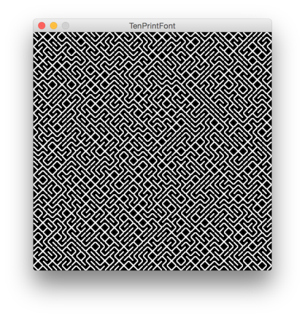

Demos 04
========

## 10PRINT Demos

A couple of simple demos showing how to create and use custom fonts with
*Processing* and *Fontastic*.

--- 
### 10 PRINT TTF Font Demo ###

This demo creates a custom font to reproduce the famous C64 one-liner in Processing.  

--- 
### 10 PRINT Webfont Demo ###

A simple HTML website, showing how to use of the font online:

### CA Demo ###

A demo using basic *Mathematica* Syntax to create a Cellular Automaton Pattern

