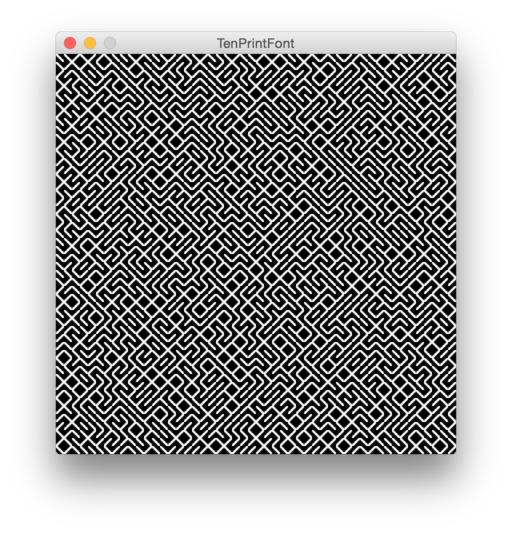

# Notation Systems 

## Working with Expressions

In the 1st part of this lecture we will learn to use *Mathematica* for:

- taking expressions apart
- modifying expressions

Check out the [introduction to expressions](../tools/lang/mathematica-expressions).

## Working with Sequences

In the 2nd part of this lecture we will learn to use *Mathematica* for:

- taking sequences apart
- modifying sequences

Check out the [introduction to sequences](../tools/lang/mathematica-sequences).

## Generating Fonts

In the 3rd part of this lecture we will learn to use *Processing* & *Fontastic* to:

- generate fonts
- use the fonts to create custom notations

# Demos

The demos can be found [here](demos).

# Exercises

The exercises can be found [here](exercises).

# Links

* [Animation of Elementary Mathematica Functions](http://reference.wolfram.com/legacy/flash/) (Yay, Flash!)
* [Fontastic](http://code.andreaskoller.com/libraries/fontastic/) (Processing Library)