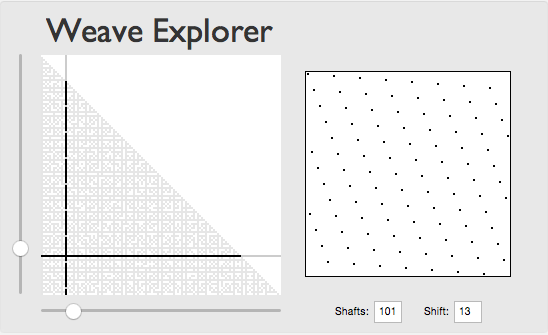

Demos 07
========

## Weave Construction ##

### Periodic Table of Weaves ###

Here's a periodic table of weave construction for up to 16 shafts.

* rows correspond to the number of shafts
* columns correspond to the amout of shift
* black boxes contain valid weaves
* light boxes contain invalid weaves
* left-slanting twills on the 1st row (offset +1)
* right-slanted twills on the diagonal (offset -1)

**Note**:  
Weaves are only valid if the number of shafts and the shift have no common devisor except for the number 1. Such numbers are also known as [Co-Primes](https://en.wikipedia.org/wiki/Coprime_integers)

### The Weave of Weaves ###

The map of coprime integers that denominate valid weaves form an interesting pattern.  
Here's the table of weave construction for up to 401 shafts and shifts.

### Weave Explorer ###

The demo contains an interactive Weave explorer. *Try it out!* 

* Enter values directly into the text fields
* Use the sliders to adjust the position on the plane
* Or click on the canvas to pick a location on the map

## Drafting ###

A couple of demos related to weave drafting.  
Play with them [here](Drafting).