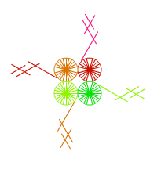

# Pa++ern 


```
             ^ ?  /  (?),,,,...v
     i      ^^(?),/  (?),,,....vv   !
     ii    ^^^ ?  /  (?),,,,...vvv  !!
     iii  ^^^^(?),/  (?),,,....vvvv !!!
     *o(|-?),.      (?),,,...
```



```
     (        ^ ?  /  (?),,,,...v
     i      ^^(?),/  (?),,,....vv   !
     ii    ^^^ ?  /  (?),,,,...vvv  !!
     iii  ^^^^(?),/  (?),,,....vvvv !!!
     *o(|-?),.      (?),,,...
     <(?),.)....
```

")

```
(^),.(<),..
(
    (
        (           ^ ?  /  (?),,,,...v
            i      ^^(?),/  (?),,,....vv   !
            ii    ^^^ ?  /  (?),,,,...vvv  !!
            iii  ^^^^(?),/  (?),,,....vvvv !!!
            *o(|-?),.       (?),,,...
            <(?),.
        )....
        vvvv
    )....   
    (^^^^)....>>>>
),
```

Explanation

```
shift starting point to somewhere top left
(column:
	(four-pattern:
		(single-pattern:
		- crossing straight lines: 
		    1. add transformations
		    2. draw line
		    3. add inverse transformations
		- same for filled circle
		turn 90°
		)repeat single-pattern to form four-pattern
	move down
	)repeat four-pattern to form column
	go to top again, move to right
)repeat column to form grid
```

