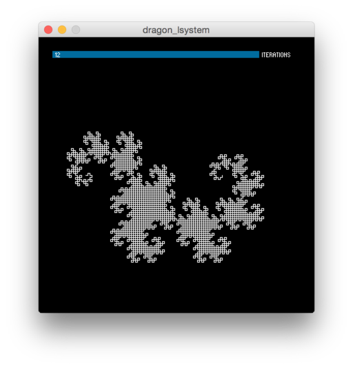

Generating Fractal Curves
=========================

A couple of sketches that show how to generate fractal curves in Processing.

### [Dragon L-System](processing/dragon_lsystem) ###

This is a simple Processing sketch that genrates the Dragon Curve using an L-System.

* You can find the L-System rules for well known fractal curves on Wikipedia
* We are using the ControlP5 library for the GUI
* Implementation is straight forward
* Rules are still kind of hardcoded

