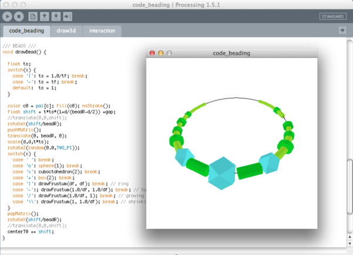
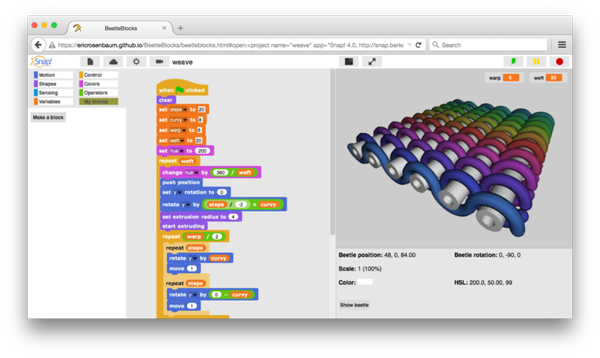

Code Crafting
=============

Here's a little overview of tools for programming craft. 

## Code Weaving ##

### Painter Weaving Language ###

The Weave tool by Kai Krause was part of Corel Painter.

* [Weave Tool Tutorial](http://www.robinwood.com/Catalog/Technical/OtherTuts/Painter/PainterWeaves1.html)
* [The Painter Weaving Language](https://www.cs.arizona.edu/patterns/weaving/webdocs/gre_pwl.pdf) (Article by Ralph Griswold)

### Andrew's Weaving Language ###

Andrew Glassner used to author a column for *IEEE Computer Graphics and Applications*. Here are three articles describing how to write weaving software, and a programming language for weaving:

* Andrew's Digital Weaving Articles: [Part 1](http://www.glassner.com/wp-content/uploads/2014/04/CG-CGA-PDF-02-11-Digital-Weaving-1-Nov02.pdf), [Part 2](http://www.glassner.com/wp-content/uploads/2014/04/CG-CGA-PDF-03-01-Digital-Weaving-2-Jan03.pdf), [Part 3](http://www.glassner.com/wp-content/uploads/2014/04/CG-CGA-PDF-03-03-Digial-Weaving-3-Mar03.pdf)
* [Digital Weaving Gallery](http://www.glassner.com/creative/art/digital-work/digital-weaving/)

The source code for Andrews compiler used to live [here](http://www.glassner.com/glassner/cg/cga/freeware/AWL.cs).

## Code Stitching ##

* [Pa++ern Coding](http://www.rzm-dev.com/pattern/) (Pa++ern)
* [Turtle-Craft Sandbox](https://github.com/bitcraftlab/turtlecraft) (Javascript)

## Code Beading ##

Martin's Beading Language is very much inspired by the Pa++ern Language for embroidery. Here's a screenshot from a Processing Implementation:

If you are interested in beading, I can publish the tool on github.

## Code Cutting ##

[Dress Cut](http://web.media.mit.edu/~jacobsj/thesis/?page_id=80) is a very smart coding environment for programming laser cut patterns by Jennifer Jacobs. She also created [Codeable Objects](http://web.media.mit.edu/~jacobsj/#_codeable_objects), a laser cutting library for Processing.

* Dress Code [Source Code](https://github.com/pixelmaid/DressCode_v0.5) (github)
* Codable Objects [Source Code](https://github.com/pixelmaid/Codeable_Objects) (github)

## Code Masonry ##

If you want to create 3D structures with code, there are many approaches.  
[Beetle Blocks](http://www.beetleblocks.com) by Andrew Rosenbaum is a nice block-based programming langugae based on Scratch + Snap.

Here's an example where I used *Beetle Blocks* to code a woven structure:

* Beetle Blocks [Source Code](https://github.com/ericrosenbaum/BeetleBlocks) (github)

# Links #

* [Code Crafting](http://www.k2g2.org/wiki:code_crafting) *on the k2g2 Craftopedia*
* [Open Tools for Computational Craft](http://www.bitcraftlab.com/talks/meshcon2014/html5)

