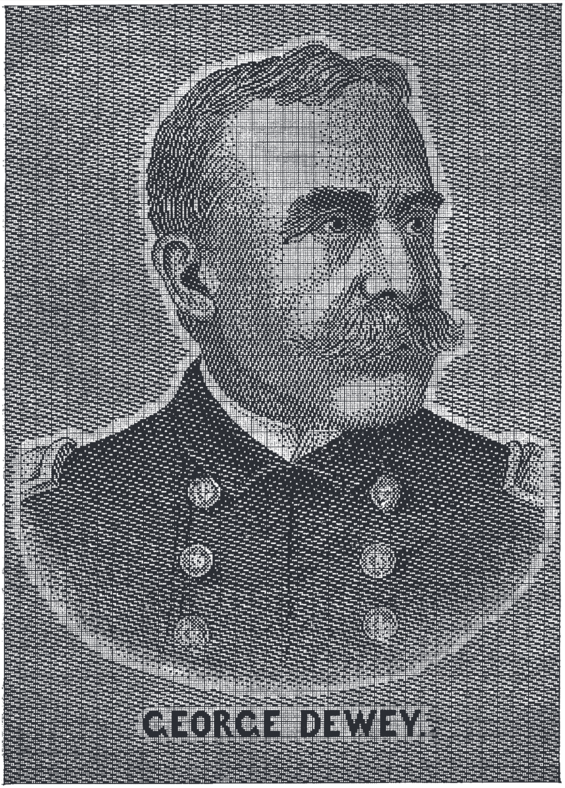

# Image Crafting #

This is a list of projects and techniques that explore the relation of the photographic image, craft and fabric. The methods rely on various tricks to use the material as simulacrum to overcome the limitations of the medium.

## Dithering and Halftoning ##

* *Halftoning* is used in print
* Limited number of colors (monochrome, CMYK)

### Popular Dithering ###

* Random Dither (simple but crappy)
* Ordered Dither (Bayer Matrix)
* Floyd-Steinberg Dither (Error Diffusion)

### Esoteric Dithering ###

* *10PRINT Shader* – [truecolor](http://pixelshaders.com/editor/#5d0000010003050000000000000017ee0c0a802118166557eb981ccd8e08c50a4bf37e4780e3f3a984d10376756cc30c13a62db485edc112a62d5e0e1d36f3d1b80250702587d7cc8258c685a03baa270b6e85b1f863d73ee34a69d7560f3f617cbd27ac6f5437128442d457b1ee5d55179bea98d6cc728295cbaf0d13dda7e0896299d74f63dd5a58d8263fceaba5f6b05f84207af3f0c8e5eae338df02bde38524e8a08937ee092170eb6386327274b234a156753c491ac572d9b3a018525a08c30f153e2b01ceef11d9e26ff379b49438593e3cb287eff891af259078b603b00c0d2560c247479fb2d1b5b145d00e71cada86e4bce1e1750560a7ac893334c883b894ad175fabb1c86c80d6e1429c93c51b406a2366b1ce7907428b5d1b88df00310a5749a7e06b3a00b9a8ae6662098c00d68de684ee5c702cd37a4c4c97ce4ff49ab1ddd990d9dcfdd22531cf0d491354182f95fb6d76e872cddcad7457f30ac4dcb3e19764f155fac2e5b4cff8f45c1d3d0f5f31a40c485668ab53cea11f026906cdc0105d56f90ac87e018c2a91e926ed51d4db501ae2074824abd972879028f2f2b5b826cf00e70f411c37f3b421f30299eb4391425b404ffc9a30e0e6a834185e3590b3d44d5fa2433db62fa232a760c6a156c70ed8849fdc7ac345acd6aa6b54457746b8fe8954220f4a0f3877c402c24ff56e3563a48787d0ee43f0f8d463d4a95b31afdd429b09f06ea02052bbc9e079a7c3e17d306909362f0f05fcf19388e80eee8942b5058e7ff049b248ee3e7717790c1f09f960e4bce63291a0e92ddb00fcee2497bc244c37f17a9c350eac1a1e6a1be8af6df6a86f0574c161db508a4fff67e45b00) + [C64 color](http://pixelshaders.com/editor/#5d0000010069050000000000000017ee0c0a802118166557eb981ccd8e08c50a4bf37e4780e3f3a984d10376756cc30c13a62db485edc112a62d5e0e1d36f3d1b8025227ae9c54cfa093720340a3ccc8e121e7d12097a03035be476a13f0e5087a6007cd6f0abc0592d217f802b3b54d3871aa025560d452c050a1031188a36ecc26371828bba726f050cd3cbd79254e351fe34259e484dd191d1434d3039e965cd7c2343c14110de95a09033bed12ea256aae5c225604f838e0bcd398a116ba1eaf0aad7198d83c8e5d4e5127adc9ac901f7137b545f7da6e0f487e62c3389aefb4dd615c761ab419deac72796c6eee4336924962b646b6acbea6a30e03bd61b7e0608dabea4d2c1d4a6da05c1ffe15def59dc0888ced407e187626b0f2dcdf950b5b78f4ceed3ec2ffd3780d1dc9ef597c956674e759a0f7709b82b424787051a570927b2aaba09e6ec3d10e652ce5ae418be7e9cf8421fbc3dcb89439b3f230666ff648036e3ad7fc81803806c91aedb965608240c4c5ebd999d8ef1ffafa1547b519f6b230e3c4ce0ec218269e55e1e048c33b708342a6533680a85b5d446f13210f3645029d4098eba78a0d43ef77570a8bad1f7913e95681188b6696e67dbce791aefc8c68545c51566cccdf8059bbf6b65752ac43d1a2441f624f3b20ee211b3d53c6f4cf536dee16b246a44957ef75adab5fe0104a6ae4765354d428a6011195ae1c7048327e6ce24ce782304d3b5552224f21138d95e7f0412035528d152d6816d546f0499acb90df7f1d8a35f1c5ec6122211d6139535a4a8a790f841ca41075ecffbc3cebb6739c0f094c784daa23d9cae6c7bb7c556507212bcc3b6643c25122ef70d31f1b40dd7dbf9d5f5a52ab51d60202233de6d7549aed695b6bb7fff40a3bffdff759cf)

This image depicts the famous Landscape also known as [Bliss](https://en.wikipedia.org/wiki/Bliss_%28image%29).

### Popular Halftoning ###

* Linear Halftoning (Simulates linear Engraving)
* Cross-Hatching

### Esoteric Halftoning ###

* Linear Halftoning based on a spacefilling curve
* Reaction-Diffusion based Halftoning

*Face of Christ* – circular engraving by Claude Mellan (1649)

## Image Knitting ##

* Simple to do with multi-color knitting
* Raster graphics can be reduced in color using **Dithering**

Dithering is achieved by reducing the number of colors of an image while arranging the pixels, so they add up to form the original colors when seen from a distance.

Here's a the *Bitmap Balaclava* by Andrew Salomone:

It might as well be a dithered version of the Shroud of Turin...

## Image Weaving ##

### Grayscale Image-Weaving ###

* Popularized with the invention of the Jaquard Loom.
* Severe Constraints imposed by weavability

The first image-based tapestry was dedicated to Jean-Marie Jacquard:

Here's a war tapestry example from the cover of *Construction of Weaves*:

And finally *Mao's Eye* from Lisa Lee Peterson's article in Ars Textrina (highly recommended).

### Color Image Weaving ###

Approach suggested by Zhou, Jiu:

* Very similar to multicolor-dithering 
* Combine satin weaves to balance out the colors
* Use a Database of *Gamut-Weaves* 

*Source: Zhou, Jiu*

## Image Embroidery ##

### Blackwork Embroidery ###

Blackwork embroidery has developed various tricks to achieve shading:

This embroidery uses a method similar to dithering:

This one uses both stitch strength and different kinds of patterns:

Also note the similarities between shading in blackwork and the filling patterns popularizes by MacPaint.

Here is a nice sampler that brings together what belongs together:

Also note the Japanese art of [Shashiko](https://en.wikipedia.org/wiki/Sashiko_stitching), that emerged independently from European blackwork, providing a more abstract way of fillng the space with linear patterns.

### Image Stippling ###

The technique of **Image Stippling** is closely related to dithering.  
But this time it's about arranging a group of stipple points on a continuous plane, rather than turning pixels on and off.

### TSP Embroidery ###

Once we have arranged points in the plane we can connect them.
A well-known method to do this is the shortest path, which is the solution to the TSP problem, popular in Computer Science.

This is a picture of Mona Lisa, made up trace that connects 100.000 points:

Here's a nice TSP Craftimation by Nina Paley:

### Fractal Embroidery ###

Fractal embroidery can be found in folk art and computer art. 
Here's an example of Armeninan embroidery,

 
Image based fractals do not need a stippling phase, since the fractality of the curve is directly controlled by the underlying image.

Here's an example of image based fractal embroidery I did.  
(It's a snapshot from a craftimation)  

If anyone is interested in exploring fractal image embroidery, let me know!  
I'll dig up the code and publish a blog post about it.

Here is an image based fractal by [Cameron Browne](http://www.cameronius.com/).  
It uses fractal subdivision of Truchet tiles:

This approach can readily be applied to fractal embroidery!

## Links ##

### Dithering and Halftoning ###

* [Reaction-Diffusion Halftoning](http://jasondorie.com/page_cnc.html) — Video [here](https://www.youtube.com/watch?v=xoJDTPRqI6o).

### Image Knitting ###

#### Dithering ####

* [Dithering](https://en.wikipedia.org/wiki/Dither) (wikipedia)
* [Floyd-Steinberg Dithering](https://en.wikipedia.org/wiki/Floyd%E2%80%93Steinberg_dithering) (wikipedia)
* [Atkinson Dithering](http://www.evilmadscientist.com/2012/dithering/) (processing)
* [10PRINT Dithering](http://www.openprocessing.org/sketch/82451) (processing)
* [Hilbert Dithering](http://www.openprocessing.org/sketch/42788) (processing)

--- 

### Image Embroidery ###

#### Stippling ####

* [StippleCam](http://joyofprocessing.com/blog/2011/11/stipple-cam/) (processing)
* [StippleGen](https://github.com/craftoid/StippleGen) (processing)
* [Weighted Voronoi Stippling](http://mrl.nyu.edu/~ajsecord/npar2002/npar2002_ajsecord_preprint.pdf) (pdf)
* [Stippling and Blue Noise](http://www.joesfer.com/?p=108) (blog post)
* [Stippling by Flight404](http://roberthodgin.com/stippling/) (blog post)

#### Image Based TSP ####

* [TSP Art](http://wiki.evilmadscientist.com/TSP_art) (wiki)
* [Color TSP Art](http://wiki.evilmadscientist.com/Color_TSP_art) (wiki)
* [TSP Art Instances](http://www.math.uwaterloo.ca/tsp/data/art/) (data)
* [TSP Worms](http://www.openprocessing.org/sketch/78541) (processing)
* [TSP Art Demo](http://demonstrations.wolfram.com/TravelingSalesmanArt/) (mathematica)

#### Fractal Embroidery ####

* [Fractal Embroidery on Craftopedia](http://www.k2g2.org/wiki:fractal_embroidery) (wiki)
* [Meandering Code Project](https://github.com/bitcraftlab/meandering-code/) (blog)
* [Fractal Image Embroidery in Motion](https://www.youtube.com/watch?v=2xvczE4-5hs) (video)
* [Truchet Curves and Surfaces](http://ccg.doc.gold.ac.uk/papers/browne_cag08_2.pdf) (pdf)

--- 

### Image Weaving ###

* Charles G. Petzold: [The Construction of Weaves](https://www.cs.arizona.edu/patterns/weaving/monographs/pcg_wev7.pdf) (image weaving draft on the cover)
* Lisa Lee Peterson: [From Image to Woven Structure](http://ulita.leeds.ac.uk/files/2014/06/7.From-image-to-woven-structure.pdf) (recommended)
* Zhou, Jiu, [Innovative Jacquard Textile Design Using Digital Technologies](http://www.sciencedirect.com/science/book/9781845697112) (book)
* Zhou, Jiu: [Merging Digitization Technology into Jacquard Fabric Creation](http://www.sd.polyu.edu.hk/iasdr/proceeding/papers/Merging%20Digitization%20Technology%20into%20Jacquard%20Fabric%20Creation%20.pdf) (paper)

