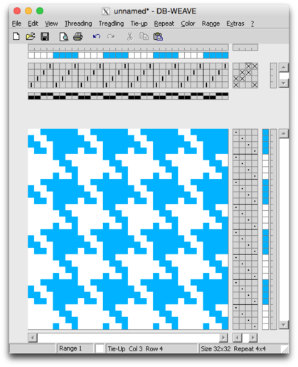
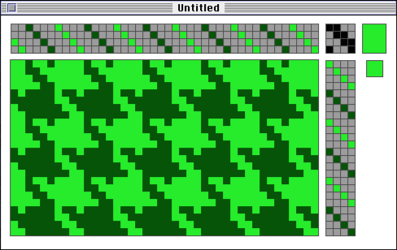

## Weaving Software ##

### DB-Weave ###

[DB-Weave](https://www.brunoldsoftware.ch/dbw_g.html) is not open source, but it’s an excellent piece of software.  
Also it kind of works cross platform and it’s free like in beer...   
The [manual](https://www.brunoldsoftware.ch/dbw_manual.pdf) (PDF) comes with a really nice tutorial included!

DB-Weave seems to work nicely under OSX using Wine-based Emulators
(I used [Wineskin](wineskin.urgesoftware.com/) with the latest engine — WS9Wine1.7.31)

### Weave Draft ###

I found another freeware weaving program that runs under Mac OS:

It hasn’t been updated for like 20 years or so, but if you are into retro computing check it out ;-)  
I found it works nicely under [Basilisk II Emulator](http://www.emaculation.com/doku.php/basilisk_ii) running [MacOS 7.5.3](http://www.emaculation.com/doku.php/basiliskii_osx_setup).  
It’s really more of a toy program and comes with it’s own text based file format.

### ArahWeave ###

Don’t use it! You can’t export WIF files in the demo version!  
It’s not open source — only the MS Paint clone that comes included with it.  
And don’t even try to install it on OSX — The installer is really a mess!  

## Beading Software ##

* [jBead](http://www.jbead.ch/de/) is an open source software dedicated to pearl beading
* [Häkelkugel-Designer / Baden Bead Designer](http://adventskalender-perlenhaekeln.blogspot.de/2011_12_24_archive.html
) (freeware)

There is a whole community based on the art of pearl beading.  
If you sign up for [Perlenhäkeln.de](http://www.perlenhaekeln.de) you can also download patterns for jBead.